# cycle-image-gan revision for Colab

This is cycle-image-gan revised version for Google Colab.

Refer to [https://github.com/suetAndTie/cycle-image-gan](https://github.com/suetAndTie/cycle-image-gan) for original source version, <br>
it is implementation for the paper [Cycle Text-To-Image GAN with BERT](https://arxiv.org/abs/2003.12137).

Refer to troubleshooting [issues](https://github.com/rightlit/cycle-image-gan-rev/issues) while running with original source code. 

### Dependencies
python 3.6

Pytorch 1.7.0+cu101


## Data
1. Download AttnGAN preprocessed data and captions [birds](https://drive.google.com/open?id=1O_LtUP9sch09QH3s_EBAgLEctBQ5JBSJ)
2. Download the [birds](http://www.vision.caltech.edu/visipedia/CUB-200-2011.html) image data. Extract them to `data/birds/`

## Instructions
* pretrain STREAM
```
python pretrain_STREAM.py --cfg cfg/STREAM/bird.yaml --gpu 0
```
* train CycleGAN
```
python main.py --cfg cfg/bird_cycle.yaml --gpu 0
```

**Examples generated by cycle-image-GAN**

 bird example              |  bird example
:-------------------------:|:-------------------------:
the medium sized bird has a dark grey color, a black downward curved beak, and long wings. | the bird is dark grey brown with a thick curved bill and a flat shaped tail.
 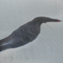 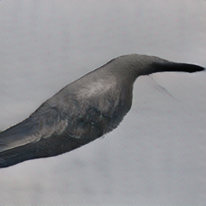 | 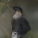 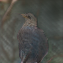 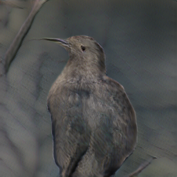
bird has brown body feathers, white breast feathers and black beak | this bird has a dark brown overall body color, with a small white patch around the base of the bill.
 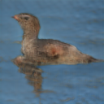 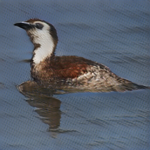 | 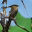 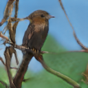 
the bird has very long and large brown wings, as well as a black body and a long black beak. | it is a type of albatross with black wings, tail, back and beak, and has a white ring at the base of its beak.
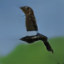   |  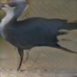 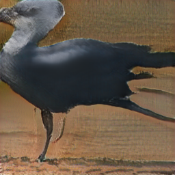
this bird has brown plumage and a white ring at the base of its long, curved brown beak. | the entire body is dark brown, as is the bill, with a white band encircling where the bill meets the head.
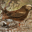 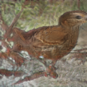  |  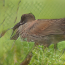 
this bird is gray in color, with a large curved beak. | a large gray bird with a long wingspan and a long black beak.
  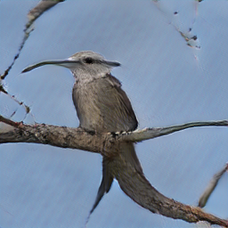 |  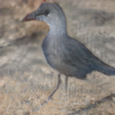 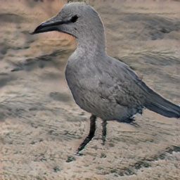
