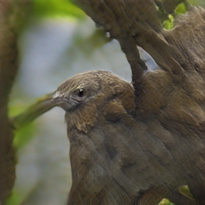
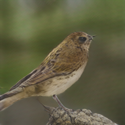
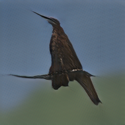
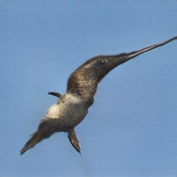

# cycle-image-gan revision and demos

This is cycle-image-gan revised version for Google Colab.

Refer to [https://github.com/suetAndTie/cycle-image-gan](https://github.com/suetAndTie/cycle-image-gan) for original source version,  
it is implementation for the paper [Cycle Text-To-Image GAN with BERT](https://arxiv.org/abs/2003.12137).

Refer to troubleshooting [issues](https://github.com/rightlit/cycle-image-gan-rev/issues) while running with original source code. 

### Dependencies
python 3.6

Pytorch 1.7.0+cu101

### Data
1. Download AttnGAN preprocessed data and captions [birds](https://drive.google.com/open?id=1O_LtUP9sch09QH3s_EBAgLEctBQ5JBSJ)
2. Download the [birds](http://www.vision.caltech.edu/visipedia/CUB-200-2011.html) image data. Extract them to `data/birds/`

**Pretrained model**
- Generate pytorchic [pretrained BERT model](https://github.com/rightlit/pytorchic-bert-rev) from birds captions for corpus data.

**Sampling**
- Run `python main.py --cfg cfg/eval_bird.yml --gpu 0` to generate examples from captions in files listed in "./data/birds/example_filenames.txt". 

**Examples generated by cycle-image-GAN**

 bird example (google bert model)             |  bird example (local pretrained model)
:-------------------------:|:-------------------------:
the medium sized bird has a dark grey color, a black downward curved beak, and long wings. | the medium sized bird has a dark grey color, a black downward curved beak, and long wings.
 | 
the bird is dark grey brown with a thick curved bill and a flat shaped tail. | the bird is dark grey brown with a thick curved bill and a flat shaped tail.
 | 
bird has brown body feathers, white breast feathers and black beak | bird has brown body feathers, white breast feathers and black beak
 | 
this bird has a dark brown overall body color, with a small white patch around the base of the bill. | this bird has a dark brown overall body color, with a small white patch around the base of the bill.
 | 
the bird has very long and large brown wings, as well as a black body and a long black beak. | the bird has very long and large brown wings, as well as a black body and a long black beak.
 | 

**Reference**

- [AttnGAN: Fine-Grained Text to Image Generation with Attentional Generative Adversarial Networks](https://arxiv.org/abs/1711.10485) [[code]](https://github.com/taoxugit/AttnGAN)
